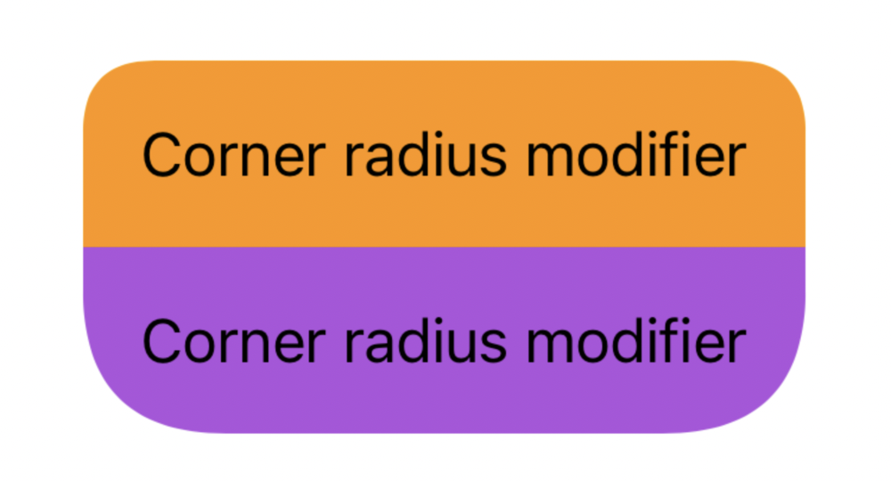
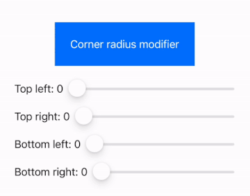
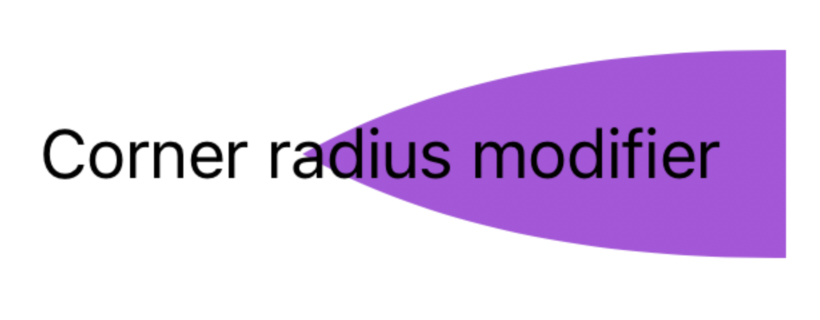
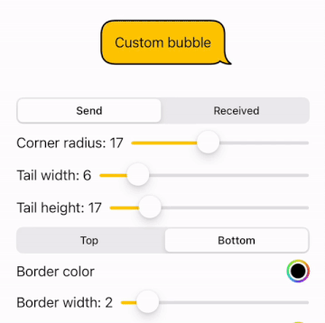
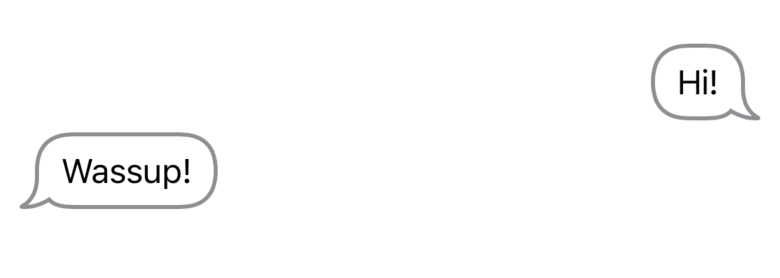
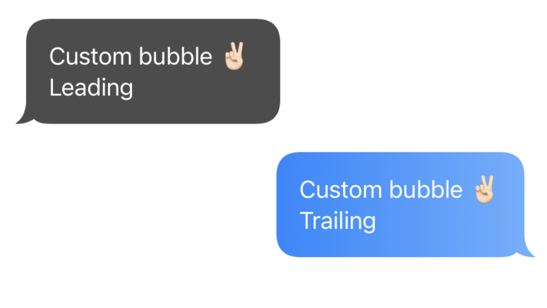

# Shapes

[](https://github.com/c-villain/Shapes/releases/latest)
[](https://swiftpackageindex.com/c-villain/Shapes)
[](https://swiftpackageindex.com/c-villain/Shapes)
[](https://swift.org/package-manager/)


[](https://t.me/lexkraev)
[](https://telegram.dog/swiftui_dev)

Different shapes on pure SwiftUI

👨🏻‍💻 Feel free to subscribe to channel **[SwiftUI dev](https://t.me/swiftui_dev)** in telegram.

## Requirements

- iOS 13.0 or macOS 10.15

## Installation

#### Swift Package Manager

To integrate ```Shapes``` into your project using SwiftPM add the following to your `Package.swift`:

```swift
dependencies: [
    .package(url: "https://github.com/c-villain/Shapes", from: "0.1.0"),
],
```
or via [XcodeGen](https://github.com/yonaskolb/XcodeGen) insert into your `project.yml`:

```yaml
name: YourProjectName
options:
  deploymentTarget:
    iOS: 13.0
packages:
  Shapes:
    url: https://github.com/c-villain/Shapes
    from: 0.1.0
targets:
  YourTarget:
    type: application
    ...
    dependencies:
       - package: Shapes
```

## Quick start

All examples you can find in demo project inside package.

There are different custom shapes provided by `Shapes`.

👇🏻 Tap on its name to see description and example of using.

<details>
  <summary>CornerRadius</summary>

`RoundedRectangle` shape and `.cornerRadius` modifier is used to round specific corners:

<p align="left">

</p>

<p align="left">

</p>

Use such way:
                     
```swift
RoundedRectangle(topLeft: 0, 
                topRight: 16, 
                bottomLeft: 16,
                bottomRight: 16)
```

If you have radiuses on one side that larger than half of height or half of width: 

<p align="left">

</p>

then use chain of modifiers:

```swift
Text("Corner radius modifier")
                .foregroundColor(.black)
                .padding(16)
                .background (
                    Color.purple
                        .cornerRadius(200, corners: .topLeft)
                        .cornerRadius(200, corners: .bottomLeft)
                )
```

</details>

<details>
  <summary>Bubble</summary>

`Bubble` shape and `.bubble` modifier is used to draw messages or tips:

<p align="left">

</p>


Use such way:

<p align="left">

</p>


```swift
VStack {
    Text("Hi!")
        .padding(.horizontal, 12)
        .padding(.vertical, 8)
        .background(
            Bubble.init(type: .send,
                        cornerRadius: 20,
                        tail: (width: 6, height: 15))
            .stroke(.gray, lineWidth: 2)
        )
        .frame(maxWidth: .infinity,
               alignment: .trailing)

    Text("Wassup!")
        .padding(.horizontal, 12)
        .padding(.vertical, 8)

        .background(
            Bubble.init(type: .received,
                        cornerRadius: 20,
                        tail: (width: 6, height: 15))
            .stroke(.gray, lineWidth: 2)
        )
        .frame(maxWidth: .infinity,
               alignment: .leading)
}
.padding(20)
```

or via modifier:

<p align="left">

</p>

```swift
VStack(spacing: 20) {
    Text("Custom bubble ✌🏻 \nLeading")
        .foregroundColor(.white)
        .padding(16)
        .bubble(.received,
                withStroke: .clear,
                lineWidth: 2,
                fill: .black.opacity(0.7))
        .frame(maxWidth: .infinity, alignment: .leading)
        
    Text("Custom bubble ✌🏻\nTrailing")
        .foregroundColor(.white)
        .padding(16)
        .bubble(.send,
                withStroke: .clear,
                lineWidth: 2,
                fill: LinearGradient(
                    gradient: Gradient(colors: [.blue.opacity(0.9), .blue.opacity(0.6)]),
                    startPoint: .leading,
                    endPoint: .trailing
                ))
        .frame(maxWidth: .infinity, alignment: .trailing)
}
```

</details>

## Communication

- If you like this repository, please do :star: to make this useful for others.
- If you **found a bug**, open an issue or submit a fix via a pull request.
- If you **have a feature request**, open an issue or submit a implementation via a pull request or hit me up on **lexkraev@gmail.com** or **[telegram](https://t.me/lexkraev)**.
- If you **want to contribute**, submit a pull request onto the master branch.

## License

Shapes package is released under an MIT license.
